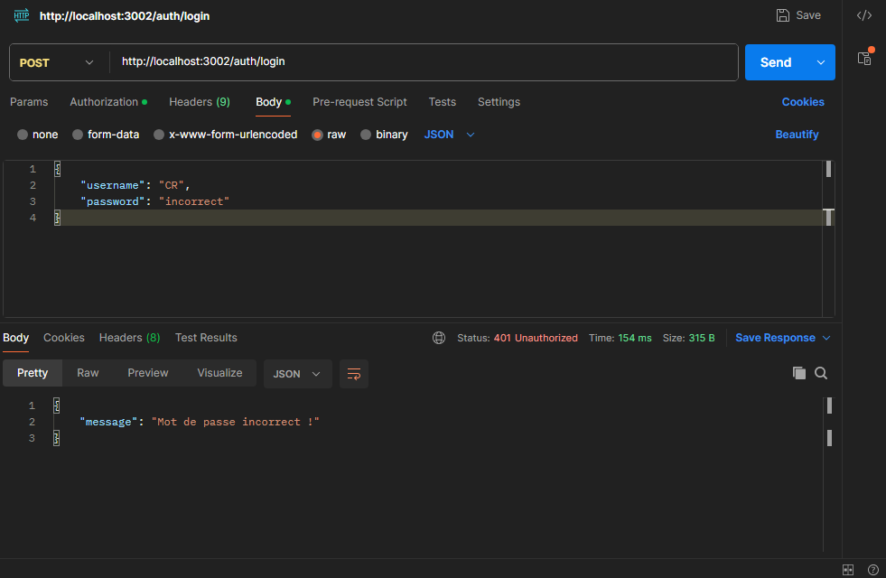
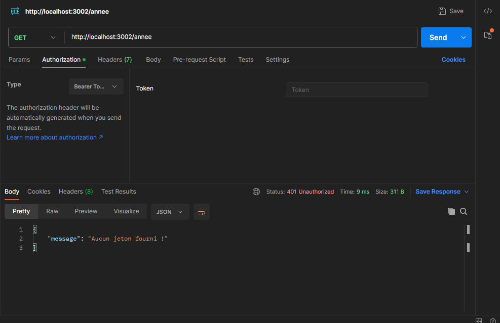
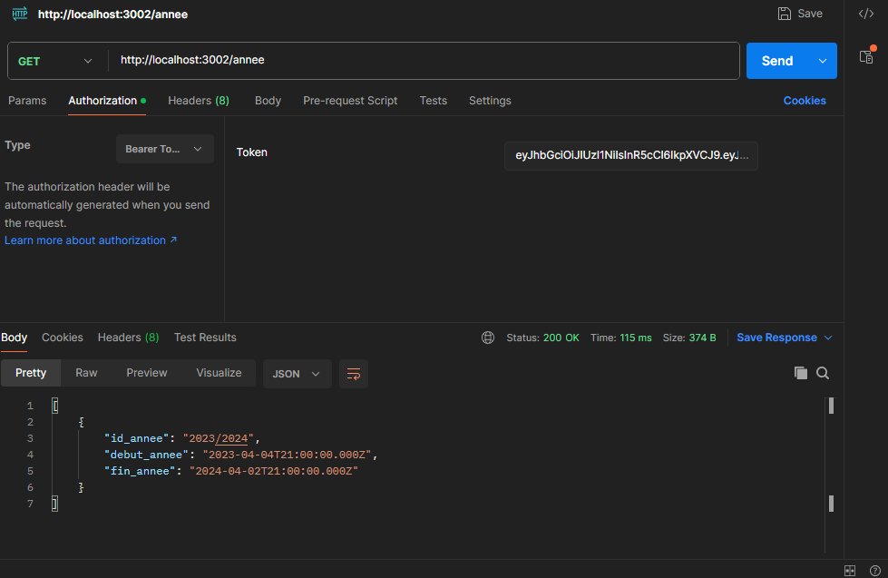

# LMD — University Grade Management API

RESTful API built with **Express.js** and **Sequelize** for managing grades, results, and academic decisions in the **LMD (Licence-Master-Doctorat)** system.

---

## Features

### Academic Entity Management
- **Academic Years** — full CRUD
- **Levels** (L3, M1, M2) — full CRUD with field of study, major, and track
- **Teaching Units (UE)** — full CRUD with credits
- **Course Elements (EC)** — full CRUD with weightings (`et`, `ed`, `ep`), semester, coefficient, and credits
- **Students** — full CRUD with student ID, last name, first name, date/place of birth
- **Grades** — full CRUD with advanced filtering (by student, level, year)

### Result Calculation Engine
- **UE average computation** — weighted average of ECs based on each EC's coefficient
- **UE validation** — credits earned if average ≥ 10 and no eliminatory grade (< 5)
- **Overall average** — weighted sum of UE averages / total credits
- **Honors** — Très Bien (≥ 16), Bien (≥ 14), Assez Bien (≥ 12), Passable (≥ 10)
- **Final decision** — ADMITTED, ELIGIBLE FOR NEXT LEVEL, ALLOWED TO RETake, EXCLUDED

### Individual & Collective Results
- Per-UE detailed breakdown for a student
- Overall result (average, credits, honors)
- Final decision for a student
- Final decisions listing for an entire level (with decision-based filtering)
- Complete student + level + year information

### Security
- **JWT** authentication (signup & login)
- Route protection middleware (token required)
- Password hashing with **bcrypt**
- Centralized error handling (operational vs internal errors)

### Code Quality
- Clean **Controller-Service-Model** layered architecture
- Automated tests with **Jest** + **Supertest** (~60 tests)
- Custom `AppError` class for consistent error handling
- Structured logger with ISO timestamps

---

## Tech Stack

| Technology | Role |
|---|---|
| **Node.js** | Runtime environment |
| **Express.js** | Web framework |
| **Sequelize** (ORM) | Database interaction |
| **MySQL** (mysql2) | Relational database |
| **JWT** (jsonwebtoken) | Authentication |
| **bcrypt** | Password hashing |
| **Jest** + **Supertest** | Testing |
| **nodemon** | Development (auto-reload) |

---

## Architecture

```
├── src/
│   ├── app.js                 # Express entry point
│   ├── config/
│   │   ├── index.js           # Config (port, DB, JWT)
│   │   └── sequelize.js       # Sequelize instance
│   ├── controllers/           # HTTP request handling
│   ├── middleware/
│   │   ├── guard.js           # JWT protection
│   │   └── errorHandler.js    # Global error handler
│   ├── models/                # Sequelize models + associations
│   ├── routes/                # Route definitions
│   ├── services/              # Business logic
│   └── utils/
│       ├── AppError.js        # Custom error class
│       └── logger.js          # Logger
├── database/
│   └── seed.js                # Database seeding script
├── tests/                     # Automated tests
├── index.js                   # Server startup
└── .env                       # Environment variables
```

---

## Prerequisites

- **Node.js** ≥ 18
- **MySQL** ≥ 8
- **npm** or **yarn**

---

## Installation

```bash
# Clone the repository
git clone <repository_url>
cd lmd-back

# Install dependencies
npm install

# Configure environment variables
cp .env .env.local
# Edit .env.local with your settings
```

---

## Configuration

| Variable | Required | Default | Description |
|---|---|---|---|
| `PORT` | No | `3002` | Server port |
| `DB_HOST` | No | `localhost` | MySQL host |
| `DB_USER` | No | `root` | MySQL user |
| `DB_PASSWORD` | No | `""` | MySQL password |
| `DB_DATABASE` | No | `noteuniversitaire` | Database name |
| `ACCESS_TOKEN_SECRET` | **Yes** | — | JWT signing secret |

---

## Usage

```bash
# Start the server in development mode
npm run dev

# Start in production
node index.js

# Seed the database with sample data
npm run seed

# Format code
npm run format

# Run tests
npm test

# Run tests in watch mode
npm run test:watch
```

---

## API — Routes

### Authentication (public)

| Method | Path | Description |
|---|---|---|
| `POST` | `/auth/signup` | Create an account |
| `POST` | `/auth/login` | Sign in (returns a JWT token) |

### Academic Years

| Method | Path | Description |
|---|---|---|
| `GET` | `/annee/` | List all academic years |

### Teaching Units (UE)

| Method | Path | Description |
|---|---|---|
| `GET` | `/ue/` | List all teaching units |
| `GET` | `/ue/get/:id` | Get a teaching unit |
| `POST` | `/ue/create` | Create a teaching unit |
| `PATCH` | `/ue/edit/:id` | Update a teaching unit |
| `DELETE` | `/ue/delete/:id` | Delete a teaching unit |

### Course Elements (EC)

| Method | Path | Description |
|---|---|---|
| `GET` | `/ec/` | List all course elements |
| `GET` | `/ec/get/:id` | Get a course element |
| `POST` | `/ec/create` | Create a course element |
| `PATCH` | `/ec/edit/:id` | Update a course element |
| `DELETE` | `/ec/delete/:id` | Delete a course element |

### Levels

| Method | Path | Description |
|---|---|---|
| `GET` | `/niveau/` | List all levels |
| `GET` | `/niveau/get/:id` | Get a level |
| `POST` | `/niveau/create` | Create a level |
| `PATCH` | `/niveau/edit/:id` | Update a level |
| `DELETE` | `/niveau/delete/:id` | Delete a level |

### Students

| Method | Path | Description |
|---|---|---|
| `GET` | `/etudiant/` | List all students |
| `GET` | `/etudiant/get/:id` | Get a student |
| `POST` | `/etudiant/create` | Create a student |
| `PATCH` | `/etudiant/edit/:id` | Update a student |
| `DELETE` | `/etudiant/delete/:id` | Delete a student |

### Grades

| Method | Path | Description |
|---|---|---|
| `GET` | `/note/` | List all grades |
| `GET` | `/note/note/:id` | Get a grade |
| `POST` | `/note/create` | Add a grade |
| `PATCH` | `/note/edit/:id` | Update a grade |
| `DELETE` | `/note/delete/:id` | Delete a grade |
| `GET` | `/note/notes/etudiant/:id_etudiant` | Get a student's grades |
| `GET` | `/note/notes/etudiant/:id_etudiant/niveau/:id_niveau` | Get a student's grades by level |
| `GET` | `/note/etudiant/:id_etudiant/annee/:annee` | Get a student's grades by year |
| `POST` | `/note/niveau/` | Get grades by level and year |

### Results — Student

| Method | Path | Description |
|---|---|---|
| `POST` | `/result/etudiant/unity` | Per-UE detailed breakdown |
| `POST` | `/result/etudiant/result` | Overall result (average, credits, honors) |
| `POST` | `/result/etudiant/final` | Final decision |
| `POST` | `/result/etudiant/` | Student + level + year info |

### Results — Level

| Method | Path | Description |
|---|---|---|
| `POST` | `/result/niveau/final` | Final decisions for an entire level (filterable by `obs`) |
| `POST` | `/result/niveau/info` | Level + year info |

> **Note**: All routes except `/auth/*` require an `Authorization: Bearer <token>` header.

---

## Result Calculation Logic

1. **UE average** — sum of (grade value × EC coefficient) across all ECs in the UE
2. **UE validation** — credits awarded if average ≥ 10 **and** no grade < 5 (eliminatory)
3. **Overall average** — `∑(UE_average × UE_credits) / ∑ UE_credits`
4. **Honors**:
   - Très Bien (≥ 16)
   - Bien (≥ 14)
   - Assez Bien (≥ 12)
   - Passable (≥ 10)
5. **Final decision**:
   - `ADMITTED` — average ≥ 10 **and** all credits validated
   - `ELIGIBLE FOR NEXT LEVEL` — average ≥ 10 **but** insufficient credits
   - `ALLOWED TO RETake` — 7 < average < 10
   - `EXCLUDED` — average ≤ 7

---

## Screenshots

### Data Verification
> The data passed with the request is verified in the database; incorrect data is handled.

<p align="center">

</p>

### Authorization
> Unauthenticated users are denied access.

<p align="center">

</p>

> Authenticated users are granted access based on their token.

<p align="center">

</p>

---

## Tests

The project includes **~60 tests** covering:

- Authentication (signup, login, error cases)
- Full CRUD for every entity (UE, EC, level, student, grade)
- Route protection (401 without token, 401 with invalid token)
- Result computation (per-UE breakdown, overall result, final decision)
- Level results (decision listing, filtering)

```bash
npm test
```

---

## License

ISC
